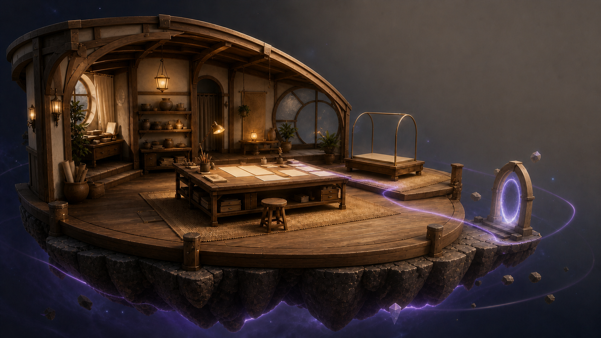

# Opening Studio visual north star v1

`SPDX-License-Identifier: CC-BY-NC-SA-4.0`



## Status and use

- **Selected:** 2026-08-30 by the maintainer after the Opening Studio grill.
- **Direction:** Variant B's mature architecture and materials, with only
  Variant C's restrained spatial seam, orbital arc, and connective glow.
- **Purpose:** concept-only, non-runtime asset. It guides hierarchy,
  silhouette, materials, camera, and anomaly grammar; it is not a
  pixel-perfect acceptance screenshot or a texture shipped by the browser
  application.
- **Implementation constraint:** reproduce the semantic composition and
  product hierarchy within the accepted browser budgets. Do not reproduce the
  concept's prop density merely to make the runtime resemble the image.

## Provenance

- **Generator:** Codex built-in ImageGen.
- **Model disclosure:** the built-in tool did not expose a concrete model ID;
  this record therefore does not claim the image was generated by
  `gpt-image-2`.
- **Generated:** 2026-08-30.
- **Output:** `opening-studio-north-star-v1.png`, 1672 × 941 RGB PNG.
- **Output SHA-256:**
  `2de42b6229aafc99c0375a5fde2e2d6b49b9be6641b55d4aba4bf5ac52d7bbd9`.
- **Base reference SHA-256:**
  `1c1dc27f357929b89a38a89e24cd47f7d35cfa2612af220f65ee97cc19ad0e4a`.
- **Anomaly reference SHA-256:**
  `30789621f58267c736371101a50ab6b12b787b459e3e1d5eaa850b4fcb40e759`.

The two reference explorations were generated in the same design session and
remain outside the repository. Only the maintainer-selected composite is
project material.

## Final prompt

```text
Use case: compositing
Asset type: final desktop web product environment north-star concept for
Wispwork Opening Studio

Input images:
- Image 1 is the edit target and authoritative base: keep its mature
  architecture, material quality, exact camera, crop, lighting, layout, and
  semantic zones.
- Image 2 is anomaly reference only: borrow its restrained spatial seam,
  orbital arc, and faint connective glow language. Do not copy its
  architecture or replace Image 1's composition.

Primary request:
Produce one final concept image that is unmistakably Image 1 as the base,
enhanced only with a bounded selection of Image 2's meaningful multiverse
feedback.

Change only these anomaly details:
- add one elegant, subtle lavender spatial seam across or immediately beneath
  the right edge of the floating fragment
- add one restrained orbital arc around the fragment
- add a very faint lavender/cyan energy relation linking the blank central
  Brief/worktable area toward the empty Artifact display and the dormant edge
  portal; it must read as environmental world logic, not a quest marker
- allow only two or three coherently aligned small floating fragments near
  the portal
- keep the portal softly dormant rather than active

Locked invariants:
Preserve Image 1's exact weak-perspective three-quarter camera, full uncropped
floating-fragment silhouette and underside, open-front cutaway, mature arched
construction and joinery, central creative worktable, blank Brief/idea
surface, empty glass Artifact display, sparse archive/tool zone, warm amber
task lighting, wood/paper/clay/fabric/brushed-metal/frosted-glass material
hierarchy, and quiet upper-right negative space for a real HTML card.

Maintain approximately 65–70% tangible Warm Atelier and no more than 30–35%
anomaly. Worktable reads first, architecture/materials second, anomaly third.
Attainable polished real-time 3D browser art direction, not a cinematic
illustration.

Constraints:
No text, letters, logos, watermark, labels, menus, interface chrome, fake UI,
signs, or readable posters. No people, avatar, NPC, new functional zones,
city, landscape, side-scroller, grid, fantasy clutter, magical explosion,
dense particles, giant cosmic spectacle, combat, or visit affordance. No
photorealistic AAA, toy/chibi, plastic miniature, untouched low-poly asset-pack
promo, voxel, pixel, flat 2D. Do not alter the upper-right negative space.
```
