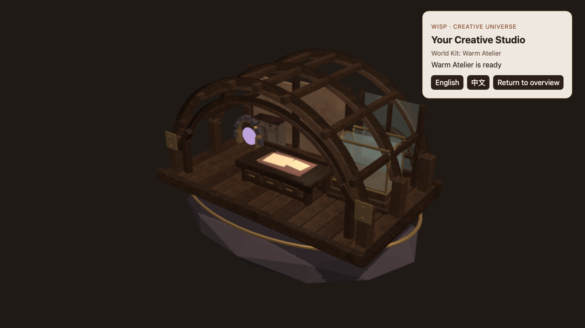
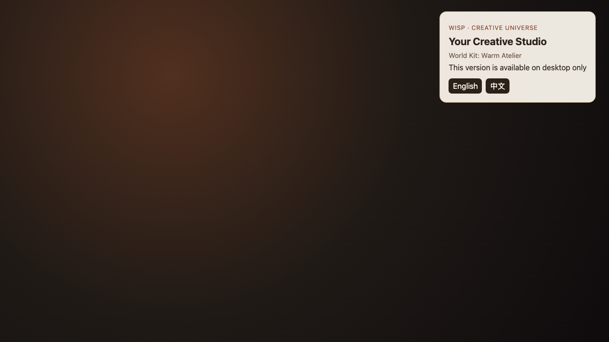

# Opening Studio runtime review v1

**Reviewed:** 2026-08-30

**Scope:** Task 1 Opening Studio at 1280 × 720, compared with the accepted
[visual north star](opening-studio-north-star-v1.md) and Visual Constitution
items 1–4. This is a prototype acceptance record, not market validation or an
acceptance claim for later Poster, Wisp, Neon, or persistence tasks.

| Accepted direction | Runnable browser frame |
| --- | --- |
|  |  |

## Judgment

| Constitution gate | Result | Evidence and limits |
| --- | --- | --- |
| 1. Creative Studio and private floating Universe | Pass | The open-front timber shell, complete faceted fragment, dark exterior void, brass orbit, and bounded portal establish both readings without an introductory sequence. |
| 2. Work surface and display before decoration | Pass | The central full-height workbench and bright blank Brief surface read first. The brass/glass display is a distinct empty fixture at right; the textured archive cabinet remains supporting. The portal is brighter but materially smaller than both functional zones. |
| 3. Mature, handcrafted, restrained result | Pass for this mid-detail prototype | Authored laminated arches, bevels, purlins, braces, joinery plates, floor planks, drawers, tool rail, stepped display, sorted glass, shared PBR surfaces, and composed CC0 furniture replace the rejected procedural hero boxes. The scene intentionally does not reproduce the concept image's prop density or cinematic finish. |
| 4. Stable weak-perspective composition | Pass | The fixed three-quarter home view keeps the whole fragment, underside, front workbench, rear structure, and right display visible. The DOM card occupies preserved upper-right negative space and does not cover a functional zone. |

The first captured orientation failed gate 2 because the exported rear wall
faced the established camera and hid the workbench. The final scene corrects
the World Kit root orientation rather than changing the accepted camera.
Subsequent review also separated the profile-owned accent from base plaster,
made the display glass actually transparent, exposed the archive cabinet, and
replaced the smooth fragment cylinder with one continuous faceted rock form.

## Automated evidence

- Four same-origin GLB containers load beneath four semantic roots.
- Mounted model geometry is 30,595 triangles; the enforced cap is 50,000.
- The two first-party GLBs total 1,867,376 bytes and all ten runtime files
  total 6,425,730 bytes.
- Twenty real WebGL mount/project/reset/dispose cycles return every reported
  resource count to zero.
- A headed Chromium sample on the demo laptop recorded 602 animation frames
  in 10,015.1 ms, or 60.11 FPS. First useful DOM was 195.9 ms and first
  interactive Studio was 1,481.3 ms in that run. These are local observations,
  not cross-device guarantees; CI records but does not threshold headless FPS.
- A failed display-GLB request enters the localized fault state; retry performs
  a fresh four-model request. Unsupported width and coarse-pointer paths make
  no Opening Studio asset request.

## Captures

- `opening-studio-runtime-v1.png`: 1280 × 720; SHA-256
  `5da4d0e3a0653164d07f1c55962586b1746d1ed455734c75999d6d522c08ffec`.
- `opening-studio-unsupported-v1.png`: 1279 × 720; SHA-256
  `d2d8735f2908c14125d4a7b5a6cf1cf084e53f4cd7d644676d39dc7d929cc5bd`.

